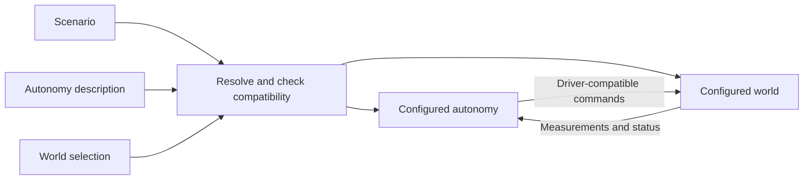

# Architecture

Current design proposal; nothing here claims implemented support. File placement and build details are in [build_and_layout.md](build_and_layout.md).

## Purpose

Use the same model-based or learned autonomy stack in Drake, on the robot, and in batched Isaac/Newton/MuJoCo Warp training. Drake is the preferred simulation and evaluation environment; algorithms may use other numerical libraries. Training must not require a separately maintained autonomy stack.

The first application is a UR7e with a Robotiq gripper placing nuts onto a pin. Start with arm tracking to establish controller reuse before manipulation. Gripper model, sensors, part dimensions and hardware command interface remain open. Placement onto an unthreaded pin is the current assumption.

## Scenario, autonomy, world

| Selection | Describes                                                                    |
| --------- | ---------------------------------------------------------------------------- |
| Scenario  | Robot, sensors, object instances, task and layout; references models and calibration |
| Autonomy  | Components, their connections and configured parameters                      |
| World     | Real installation or supported simulator setup, including execution settings |

For example, `configs/runs/nut_on_pin/drake.yaml` could contain:

```yaml
scenario: ../../scenarios/nut_on_pin/ur7e.yaml
autonomy: ../../autonomy/nut_on_pin_ur7e/stack.yaml
world: drake
```

This is illustrative syntax. A longer world description can be referenced from another file.

The scenario independently selects a robot description, sensor package, object instances, task and layout. Swapping robot or sensors can retain the same objects and task; it may require a different layout, calibration or configured autonomy. Layout describes robot/object placement and sensor attachments relative to named frames. Simulation uses these as initial/setup conditions; hardware uses them as calibrated relationships or nominal conditions to verify, not commands to reposition reality.

Measured calibration belongs to the selected installation: particular devices and their assembled relationships, potentially spanning the whole scenario. It is separate from reusable assets and nominal layout. Record which robot, sensors and mounting arrangement it applies to; a device or mounting change must not silently reuse incompatible calibration.



Robot and sensor descriptions establish available observations; the robot and selected world jointly establish accepted commands. The stack may also need a robot dynamics model, calibration, object geometry and task goals. A compatible interface is necessary, but does not establish that a controller is suitably tuned for that robot.

Keep reusable algorithms separate from configured instances. Inverse dynamics can serve many manipulators; its model, joint selection and gains belong to the selected setup. Gains can depend on tool, payload, command interface and control rate. Application configurations keep those choices together; reusable asset bundles hold intrinsic defaults.

The task specifies the outcome and evidence for success, referring only to participating object instances: a nut and pin can be task participants while the table and background objects remain part of the scene. A task description is not an autonomy component or a mandatory planning strategy. Object geometry and nominal placement do not provide its measured current pose: that needs a measurement, estimator or explicit known-pose assumption. Simulation ground truth remains distinct from deployable observations. Preserve the nut's hole in collision geometry.

## Composing autonomy

A description selects either one component, such as a pixel-to-torque policy, or a composition. Compositions contain named children, parameters, connections and exposed ports. Children can reference other compositions. There are no mandatory perception/planner/controller slots.

A component declares its logical inputs and outputs once. A composition exposes selected child ports and derives their types recursively; input fan-out must satisfy every destination. For example, a task-space trajectory generator can connect through IK to a position controller, whose output connects directly to a position-command driver.

Validate meaning, not just vector length: robot/joint identities, command mode, units, frames, shapes and timestamp conventions. Resolve model-dependent dimensions after selecting the robot. Device and batch restrictions come from the selected implementation. Ambiguous measurement bindings need an explicit mapping. Transport adapters serialize commands and map channels; an extra controller must appear in the stack.

Use ordinary YAML with safe loading and typed validation, initially PyYAML and Pydantic. Resolve references relative to their declaring file; reject duplicate keys, unknown fields and recursive inclusion. Use parameter defaults and explicit values without generic deep-merge inheritance. YAML contains no executable behavior. Hydra can later supply training sweeps outside this loader.

The composition describes connections; it does not recreate Drake's scheduling or dynamics machinery. Drake implementations construct Systems/Diagrams. Batched implementations can execute native operations without a Diagram per environment. Reject feedback dependencies the selected execution cannot support.

## Component implementations

Each component has a declaration and explicit implementations for supported worlds, preferably thin wrappers around shared algorithm code. Several worlds may use the same factory. Read declarations without importing simulator SDKs; load implementations only after selection.

Missing world support is an error. An explicitly registered CPU implementation in Isaac is allowed with a performance warning. Never silently substitute a different controller. Named variants can intentionally simplify a component or replace an entire declared subsystem while preserving its public interface. Record the chosen variant and its additional requirements, including privileged ground truth where applicable.

Implementations own algorithm state, timing and reset behavior. Expose the hooks and requirements the world needs: triggers/rates, timestamps, immediate dependencies, initialization and selective reset. The world coordinates execution and physical reset; components reset their own state. Resetting a real controller does not reposition the robot. Different worlds need not share identical schedules or physics.

For batching, declare native tensor, CPU batch or scalar execution, supported devices and known transfers. Warn about per-environment work and synchronization. Keep this metadata simple; do not build an abstract performance predictor. A tensor annotation cannot convert Drake code into a GPU kernel.

## Resolving and running

Before construction, check that the scenario/world supplies required measurements and accepts the stack's commands, every component has a selected implementation, and timing/reset requirements are supported. Record effective parameters, model/calibration versions and selected implementations. A world switch preserves the stack only when these checks succeed; simulated torque access does not establish torque access on hardware.

Use ROS 2 at hardware/process boundaries. Keep it outside ordinary component connections and batched rollout data. World integration owns scene/device access and shared execution services; wrappers own component-specific adaptation. Controller models remain separate from simulation state, so algorithms cannot accidentally read perfect simulated state.

The decisive example is the same inverse-dynamics controller in Drake and Isaac, first singly, then in a batch with independent state. An explicit CPU wrapper is a valid first step. Match controller outputs for matching inputs/state; do not require identical physics trajectories. Optimize demonstrated bottlenecks while retaining shared code and parameters. The [implementation plan](implementation_tasks.md) starts with simpler position control.

The composition from components into a Drake or Isaac simulation or deployment onto a real robot should not be ad-hoc. We should have code that works on all compositions in a DRY manner. The Drake code and the real world code should be extremely similar, ideally quite close in design to Russ Tedrake's HardwareStation if possible.
