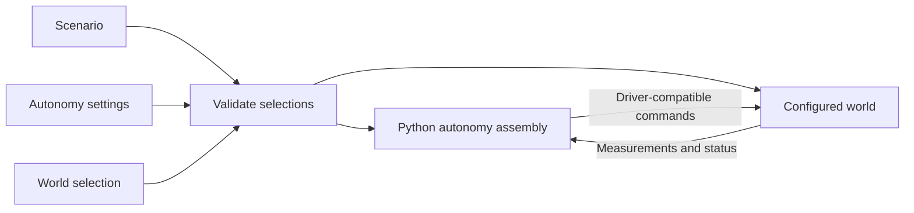

# Architecture

Target design; implemented support and remaining work are recorded in the [implementation plan](implementation_tasks.md). File placement and build details are in [build_and_layout.md](build_and_layout.md).

## Purpose

Use the same model-based or learned autonomy stack in Drake, on the robot, and in batched Isaac/Newton/MuJoCo Warp training. Drake is the preferred simulation and evaluation environment; algorithms may use other numerical libraries. Training must not require a separately maintained autonomy stack.

The first application is a UR7e with a Robotiq gripper placing nuts onto a pin. Start with arm tracking to establish controller reuse before manipulation. Gripper model, sensors, part dimensions and hardware command interface remain open. Placement onto an unthreaded pin is the current assumption.

## Scenario, autonomy, world

| Selection | Describes                                                                    |
| --------- | ---------------------------------------------------------------------------- |
| Scenario  | Selected robot system, object instances, task and layout; references models and calibration |
| Autonomy  | Python assembly functions and configured parameters                      |
| World     | Real installation or supported simulator setup, including native runtime and visualization settings |

The runnable `scenarios/arm_tracking/scenario.yaml` contains world/timing settings, a robot-system selection with its autonomy settings, object models and poses, and task parameters. The reusable physical assembly remains in `robot_system/ur7e_ideal_camera/system.yaml`. Selecting the system and autonomy together makes their compatibility visible without fixing an autonomy stack inside the assembly definition.

The scenario selects a **robot system**: a composition of robots, actuated tools and sensors, or other robot systems. The loaded configuration preserves this hierarchy, local names and relative placements; shared world assembly resolves namespaced devices and robot pose chains. Disabling sensors affects construction without deleting the declared composition. For example, a bimanual system can instantiate the same arm-with-wrist-camera definition twice. Each instance has distinct names, hardware bindings and runtime state. Internal mounts belong to the system; the scenario layout places whole systems and external objects. Simulation uses those placements as initial/setup conditions; hardware uses calibrated relationships or nominal conditions to verify, not commands to reposition reality.

Swapping robot systems, or selecting another device within a system definition, can retain the same scenario objects and task. It may require different calibration, layout or configured autonomy. Robot-system composition and autonomy composition remain separate: physical assembly does not force a particular control stack.

Robot and sensor packages own their assets, device-specific controllers/IK/drivers, calibration profiles and tests. Actuated tools belong under `robots/`. System packages own assembly-specific logic and relationships; scenario packages own task descriptions/evaluation and task-specific autonomy. Reusable numerical algorithms, configuration loading and world assembly live under `core/`. A UR7e inverse-dynamics controller should configure or specialize shared code rather than duplicate it.

Measured calibration lives with the relationship it describes: within a robot/sensor, between members of a robot system, or between that system and scenario fixtures. Record the relevant units, mounting arrangement and revision, and select the effective profile explicitly. Nominal assets/layout and measured corrections remain distinct. Nested instances must not silently share incompatible calibration or conflicting definitions of the same transform.



Robot and sensor descriptions establish available observations; the robot and selected world jointly establish accepted commands. The stack may also need a robot dynamics model, calibration, object geometry and task goals. A compatible interface is necessary, but does not establish that a controller is suitably tuned for that robot.

Keep reusable algorithms separate from configured instances. Inverse dynamics can serve many manipulators; its model, joint selection and gains belong to the selected setup. Gains can depend on tool, payload, command interface and control rate. Keep them with the robot, system or scenario whose assumptions they encode; each device owns its intrinsic asset defaults.

The task specifies the outcome and evidence for success, referring only to participating object instances: a nut and pin can be task participants while the table and background objects remain part of the scene. A task description is not an autonomy component or a mandatory planning strategy. Object geometry and nominal placement do not provide its measured current pose: that needs a measurement, estimator or explicit known-pose assumption. Simulation ground truth remains distinct from deployable observations. Preserve the nut's hole in collision geometry.

## Composing autonomy

Compose autonomy in Python using the selected runtime's native facilities. In Drake, ordinary construction functions add Systems to a DiagramBuilder, connect native ports and return Systems or Diagrams. Reuse those functions across scenarios. There is no project-wide component object, graph schema, port-type system or universal factory context. A policy can remain one System; a model-based stack can be a Diagram.

Keep scene/device assembly reusable under `core/worlds/`; put task-specific connections in the scenario and reusable stacks with their robot, system or shared algorithm owner. Controller `connect` functions wire robot observations and commands, then return native task-reference ports. The arm-tracking scenario supplies the desired state and returns a Drake `Simulator` and scene, without another simulation wrapper. Construction code checks robot identity, joint order, units, command mode and frames where they matter; equal vector lengths alone do not establish compatibility.

YAML selects physical assets, instances, layout, task, autonomy settings and world. It does not describe executable autonomy graphs, child-port exports or scheduling. Shared configuration types live together in `core/config/declarations.py`; `loading.py` parses YAML and resolves referenced systems. Use safe loading and typed validation with PyYAML and Pydantic. Resolve YAML references through `package://robo_arch/...` resources in the installed application package, independently of the declaring file or working directory; reject duplicate keys, unknown fields and recursive physical-system inclusion. Keep defaults in parameter schemas and avoid generic deep-merge inheritance. Training sweep tools can sit outside this loader.

## World implementations

Use explicit implementations for supported worlds, preferably thin wrappers around shared algorithms. A world switch reuses algorithm code and parameters; it need not reuse a parsed execution graph. Drake owns its Systems, Diagrams, scheduling and state. Batched execution uses appropriate native operations without requiring a Diagram per environment.

Read parameters and device metadata without importing simulator SDKs. Device lookup imports only selected `robo_arch.<category>.<model>.definition` modules and calls their typed `describe()` functions. The returned metadata declares supported worlds. World assembly imports the selected device adapter when needed and calls its native entry point (`add_to_plant`, `add_to_builder` or `add_to_stage`). YAML model identifiers cannot supply import paths. Scenarios select supported controllers explicitly and call their Python construction functions directly; there is no module-global implementation table or generic factory wrapper. Missing world support is an error. When a batched world supports scalar or CPU execution, warn about that cost and known transfers. Never silently substitute a different controller. Name intentional approximations, including privileged ground truth.

Implementations own timing, initialization and reset behavior. World integration coordinates physical reset; each controller or policy resets its own state. Resetting a real controller does not reposition the robot. Add timing, reset and execution metadata only when an implemented consumer needs it; no universal scheduler or performance framework is required.

### World configuration and visualization

Each world has a separate validated, SDK-independent configuration in `core/config/worlds.py`. The scenario's `world` is an inline mapping or a `package://robo_arch/...` reference to one complete profile. Unknown and foreign settings are rejected; profiles have no inheritance or deep merging. Scenario duration and evaluation stay outside the world. Simulation time steps belong to physics; real-world settings contain transport instead.

```yaml
world:
  type: drake
  target_realtime_rate: 1.0          # wall-clock pacing; zero means unpaced
  physics:
    time_step: 0.001                # seconds, independent of display cadence
    contact_model: hydroelastic_with_fallback
    discrete_contact_approximation: sap
    sap_near_rigid_threshold: 1.0
  visualization:
    type: meshcat
    mode: live_and_record
    publish_period: 0.015625
    publish_illustration: true
    publish_proximity: true
    publish_contacts: true
    publish_inertia: true
```

| World | Implemented runtime configuration | Viewer and limits |
|---|---|---|
| Drake | Discrete plant step; point, hydroelastic or fallback contact model; SAP, similar or lagged approximation; SAP near-rigid threshold; independent wall-clock pacing | Standard `ApplyVisualizationConfig` wires Meshcat illustration, proximity, inertia and contacts. Modes: `off`, `live`, `record`, `live_and_record`. Publication period and browser opening are configurable. |
| Isaac | PhysX step, TGS/PGS solver, `cpu`/`cuda:0` device | Native Kit viewport with optional collision overlay; `off`/`live` only. Rendering is experimental: live physics advanced, but native image capture and clean shutdown remain unverified. CPU PGS and GPU TGS physics were exercised without the viewer. |
| Real | ROS 2 namespace and `system`/`ros` clock declarations; no simulated physics | Independent RViz 2 launcher with `off`/`live`, fixed frame and optional package-referenced display configuration. Command/lifecycle tests use a fake process; RViz rendering and hardware execution are unvalidated. |

For example, an Isaac profile contains `type: isaac`, `physics: {time_step: 0.001, solver: tgs, device: 'cuda:0'}` and `visualization: {type: isaac, mode: "off"}`. A real profile contains `type: real`, `transport: {type: ros2, namespace: /cell, clock: system}` and `visualization: {type: rviz2, mode: live, fixed_frame: world}`. These are separate native concepts, not equivalent physics or a universal viewer API. Production solver tuning remains a deployment decision.

The CLI's `--world` replaces the complete configuration with native defaults; `--world-config` loads a complete profile. Explicit viewer overrides are validated again. Effective settings are retained with run metadata. Schema defaults leave viewers off; the packaged arm-tracking scenario explicitly selects Drake recording.

Collision geometry, friction, hydroelastic classification and mesh resolution belong to the asset or its explicit world-specific profile. Per-articulation tuning belongs to its device/system. World configuration must not silently overwrite these assumptions. Enabling a layer does not supply missing UR7e meshes or enable hydroelastic physics: the current UR7e has approximate visuals and no collision geometry. Drake contact diagnostics are checked with a separate fixture that explicitly supplies hydroelastic properties.

### Viewer lifecycle and inspection

World-specific construction and launch functions own native settings and viewer lifecycle; there is no shared visualizer base class or scheduler. Apply startup settings before opening a runtime, physics settings before finalizing its scene, and viewer wiring once scene/state sources exist. Unsupported modes and missing required displays fail explicitly. Native Isaac recording is unsupported; the runner never substitutes Drake playback.

Viewer selection is separate from sensor observations. `--headless` changes viewing intent and preserves configured sensors. Isaac currently requires the separate `--no-sensors` selection because its camera adapter is unavailable. Mouse-applied forces are disabled for observational inspection. Closing an embedded viewport hides the view; quitting its runtime interrupts execution. Drake live inspection holds the final scene until **Close inspection** or Ctrl-C; recordings remain usable after exit. RViz owns only its viewer process and subscribes to existing observations/TF without starting drivers or hardware command connections.

The runner writes all resolved inputs, configuration hashes, package versions, results/errors and a copyable `--inspect` command. Inspection restores those inputs and overrides only viewing intent; source/assets are identified by hashes and versions, not snapshotted. Headless tests and visual inspection use the same physics, initial state and sensor selections. Retain partial recordings or measured traces on runtime failures where available, and attach an actual run visualization when requesting human review. Seeds and calibration versions must be included when those features are introduced.

Drake HTML retains geometry transforms and force arrows, but changing hydroelastic contact surfaces and pressure fields need live inspection; a saved surface can be a static final mesh. The explicit `replay_positions` helper remains secondary geometry inspection: a position trace cannot reconstruct source-world contacts, pressure, velocities or sensor images. Real-world replay requires recorded observations and TF; no hardware runner exists.

Validation covers schema rejection without SDK imports, native Drake settings/standard visualization, a hydroelastic contact fixture, and numerical consistency with the viewer disabled. Isaac viewport/collision rendering and actual RViz frames/topics remain acceptance work. Arm tracking does not establish robot contact support or matching physics between engines.

## Constructing and running

Before construction, check that the scenario/world supplies required measurements and accepts the stack's commands, the selected autonomy has a supported implementation, and timing/reset requirements are supported. Record effective parameters, model/calibration versions and selected implementations. A world switch preserves the stack only when these checks succeed; simulated torque access does not establish torque access on hardware.

Use ROS 2 at hardware/process boundaries. Keep it outside ordinary component connections and batched rollout data. World integration owns scene/device access; wrappers own algorithm-specific adaptation. Controller models remain separate from simulation state, so algorithms cannot accidentally read perfect simulated state.

The decisive example is the same inverse-dynamics controller in Drake and Isaac, first singly, then in a batch with independent state. An explicit CPU wrapper is a valid first step. Match controller outputs for matching inputs/state; do not require identical physics trajectories. Optimize demonstrated bottlenecks while retaining shared code and parameters. The [implementation plan](implementation_tasks.md) starts with simpler position control.

Share physical assembly and control construction functions across simulation and deployment, following the separation illustrated by HardwareStation. Runtime-specific application wiring stays ordinary code; reuse does not require reimplementing Drake's Diagram architecture in a parser.
