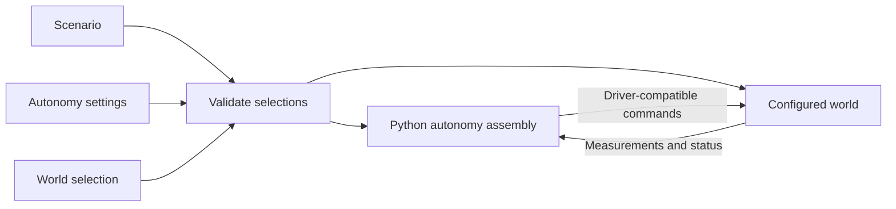

# Architecture

Target design; implemented support and remaining work are recorded in the [implementation plan](implementation_tasks.md). File placement and build details are in [build_and_layout.md](build_and_layout.md).

## Purpose

Use the same model-based or learned autonomy stack in Drake, on the robot, and in batched Isaac/Newton/MuJoCo Warp training. Drake is the preferred simulation and evaluation environment; algorithms may use other numerical libraries. Training must not require a separately maintained autonomy stack.

The first application is a UR7e with a Robotiq gripper placing nuts onto a pin. Start with arm tracking to establish controller reuse before manipulation. Gripper model, sensors, part dimensions and hardware command interface remain open. Placement onto an unthreaded pin is the current assumption.

## Scenario, autonomy, world

| Selection | Describes                                                                    |
| --------- | ---------------------------------------------------------------------------- |
| Scenario  | Selected robot system, object instances, task and layout; references models and calibration |
| Autonomy  | Python assembly functions and configured parameters                      |
| World     | Real installation or supported simulator setup, including native runtime and visualization settings |

The runnable `scenarios/arm_tracking/scenario.yaml` contains world/timing settings, a robot-system selection with its autonomy settings, object models and poses, and task parameters. The reusable physical assembly remains in `robot_system/ur7e_ideal_camera/system.yaml`. Selecting the system and autonomy together makes their compatibility visible without fixing an autonomy stack inside the assembly definition.

The scenario selects a **robot system**: a composition of robots, actuated tools and sensors, or other robot systems. For example, a bimanual system can instantiate the same arm-with-wrist-camera definition twice. Each instance has distinct names, hardware bindings and runtime state. Internal mounts belong to the system; the scenario layout places whole systems and external objects. Simulation uses those placements as initial/setup conditions; hardware uses calibrated relationships or nominal conditions to verify, not commands to reposition reality.

Swapping robot systems, or selecting another device within a system definition, can retain the same scenario objects and task. It may require different calibration, layout or configured autonomy. Robot-system composition and autonomy composition remain separate: physical assembly does not force a particular control stack.

Robot and sensor packages own their assets, device-specific controllers/IK/drivers, calibration profiles and tests. Actuated tools belong under `robots/`. System packages own assembly-specific logic and relationships; scenario packages own task descriptions/evaluation and task-specific autonomy. Reusable numerical algorithms, configuration loading and world assembly live under `core/`. A UR7e inverse-dynamics controller should configure or specialize shared code rather than duplicate it.

Measured calibration lives with the relationship it describes: within a robot/sensor, between members of a robot system, or between that system and scenario fixtures. Record the relevant units, mounting arrangement and revision, and select the effective profile explicitly. Nominal assets/layout and measured corrections remain distinct. Nested instances must not silently share incompatible calibration or conflicting definitions of the same transform.



Robot and sensor descriptions establish available observations; the robot and selected world jointly establish accepted commands. The stack may also need a robot dynamics model, calibration, object geometry and task goals. A compatible interface is necessary, but does not establish that a controller is suitably tuned for that robot.

Keep reusable algorithms separate from configured instances. Inverse dynamics can serve many manipulators; its model, joint selection and gains belong to the selected setup. Gains can depend on tool, payload, command interface and control rate. Keep them with the robot, system or scenario whose assumptions they encode; each device owns its intrinsic asset defaults.

The task specifies the outcome and evidence for success, referring only to participating object instances: a nut and pin can be task participants while the table and background objects remain part of the scene. A task description is not an autonomy component or a mandatory planning strategy. Object geometry and nominal placement do not provide its measured current pose: that needs a measurement, estimator or explicit known-pose assumption. Simulation ground truth remains distinct from deployable observations. Preserve the nut's hole in collision geometry.

## Composing autonomy

Compose autonomy in Python using the selected runtime's native facilities. In Drake, ordinary construction functions add Systems to a DiagramBuilder, connect native ports and return Systems or Diagrams. Reuse those functions across scenarios. There is no project-wide component object, graph schema, port-type system or universal factory context. A policy can remain one System; a model-based stack can be a Diagram.

Keep scene/device assembly reusable under `core/worlds/`; put task-specific connections in the scenario and reusable stacks with their robot, system or shared algorithm owner. Controller `connect` functions wire robot observations and commands, then return native task-reference ports. The arm-tracking scenario supplies the desired state and returns a Drake `Simulator` and scene, without another simulation wrapper. Construction code checks robot identity, joint order, units, command mode and frames where they matter; equal vector lengths alone do not establish compatibility.

YAML selects physical assets, instances, layout, task, autonomy settings and world. It does not describe executable autonomy graphs, child-port exports or scheduling. Use safe loading and typed validation with PyYAML and Pydantic. Resolve YAML references through `package://robo_arch/...` resources in the installed application package, independently of the declaring file or working directory; reject duplicate keys, unknown fields and recursive physical-system inclusion. Keep defaults in parameter schemas and avoid generic deep-merge inheritance. Training sweep tools can sit outside this loader.

## World implementations

Use explicit implementations for supported worlds, preferably thin wrappers around shared algorithms. A world switch reuses algorithm code and parameters; it need not reuse a parsed execution graph. Drake owns its Systems, Diagrams, scheduling and state. Batched execution uses appropriate native operations without requiring a Diagram per environment.

Read parameters and device metadata without importing simulator SDKs. Device discovery imports only selected `robo_arch.<category>.<model>.definition` modules and reads their package-owned `DEFINITION`. This fixed convention replaces scenario-maintained device lists; YAML model identifiers cannot supply import paths. World factories remain lazy, and autonomy assembly selects its supported implementation explicitly. Missing world support is an error. When a batched world supports scalar or CPU execution, warn about that cost and known transfers. Never silently substitute a different controller. Name intentional approximations, including privileged ground truth.

Implementations own timing, initialization and reset behavior. World integration coordinates physical reset; each controller or policy resets its own state. Resetting a real controller does not reposition the robot. Add timing, reset and execution metadata only when an implemented consumer needs it; no universal scheduler or performance framework is required.

### World configuration and visualization (proposal)

Each world needs its own runtime configuration and configurable visualizer. Drake and Isaac use separate native viewers; RViz 2 is the likely choice for a ROS 2 hardware world. The following configuration shape is proposed, not implemented. Exact keys, defaults and supported options must be checked against the selected SDK versions; the examples do not choose production solver settings.

Extend the scenario's `world` selection from a name to a typed configuration. Keep small configurations inline. When reuse warrants a separate file, allow a `package://robo_arch/...` reference to one complete world configuration. Do not require a new run-file hierarchy or merge trees of inherited defaults. Scenario duration and task evaluation stay outside the world; the simulation step moves into its physics settings.

Illustrative alternatives for the same scenario:

```yaml
world:
  type: drake
  physics:
    time_step: 0.001                  # seconds, not the control or display period
    contact_model: hydroelastic_with_fallback
    discrete_contact_approximation: sap
  visualization:
    type: meshcat
    mode: live
    publish_illustration: true
    publish_proximity: true
    publish_contacts: true
    publish_inertia: true
```

```yaml
world:
  type: isaac
  physics:
    time_step: 0.001
    solver: tgs
  visualization:
    type: isaac
    mode: live
    collision_geometry: true
```

```yaml
world:
  type: real
  transport:
    type: ros2
    namespace: /cell
    clock: system
  visualization:
    type: rviz2
    mode: live
    fixed_frame: world
```

The shared shape selects a world and viewing intent; the contents are separate validated schemas, not a universal solver or renderer API. A world switch replaces the complete world configuration and reruns compatibility checks. It must not carry Drake parameters into Isaac or translate a solver name as if the physics were equivalent. Explicit CLI overrides may change selected fields after loading; record those changes and the effective configuration. No arbitrary SDK property dictionary or YAML import path is needed.

| World | Runtime settings to expose as consumers need them | Visualization integration |
|---|---|---|
| Drake | Plant step, contact model, discrete contact approximation, solver tolerances/iteration limits where supported; continuous integrator settings only for continuous execution | Use Drake's standard `ApplyVisualizationConfig` setup for Meshcat/Meldis publication: separate illustration, proximity, inertia and contact layers, with hydroelastic representations where available. |
| Isaac | Physics backend and execution device, step, supported solver choice, scene solver limits and GPU capacities; preserve native scene versus articulation scope | Use the selected Isaac runtime's native viewport and physics debugging facilities. Renderer, display cadence, camera and debug overlays are Isaac settings. |
| Real | Transport, namespace, clock source and connection settings; no simulated contact solver | ROS 2 state/TF publication and optional RViz 2 process/configuration. Device endpoints and calibration remain device/system-owned. |

Drake separates contact modeling from discrete contact approximation; PhysX exposes its own solver choices and collision debugging. These remain distinct configuration concepts. Native API references: [Drake plant](https://drake.mit.edu/doxygen_cxx/structdrake_1_1multibody_1_1_multibody_plant_config.html), [Drake visualization](https://drake.mit.edu/doxygen_cxx/structdrake_1_1visualization_1_1_visualization_config.html), [Isaac simulation management](https://docs.isaacsim.omniverse.nvidia.com/latest/py/source/extensions/isaacsim.core.simulation_manager/docs/index.html), [PhysX collision visualization](https://docs.omniverse.nvidia.com/kit/docs/omni_physics/108.1/extensions/ux/source/omni.physx.ui/docs/dev_guide/collision_debug_vis.html), [RViz configuration](https://github.com/ros2/rviz/blob/rolling/rviz2/doc/index.rst). These references inform the design; their latest versions do not establish compatibility with the pinned environments.

Collision geometry, friction/material properties, hydroelastic classification and mesh resolution belong to the robot/object asset or its explicit world-specific profile. Per-articulation tuning belongs to the device or configured system. World configuration selects global numerical behavior; it must not silently overwrite those physical assumptions. Enabling a display layer neither supplies missing UR7e meshes nor enables hydroelastic physics. Requests to validate collision or hydroelastic behavior must diagnose missing geometry/properties before presenting an empty layer as evidence.

### Viewer lifecycle and inspection (proposal)

Support explicit viewing intents such as `live`, `record`, `live_and_record` and `off`, only where the selected world/viewer implements them. Recording format and replay remain native to that world. Use ordinary world-specific construction/launch functions; no shared visualizer base class or scheduler is required. Inspect schemas without importing SDKs, then apply startup settings before opening the runtime, physics settings before scene finalization, and viewer wiring after the scene and state sources exist. Validate supported combinations before starting execution; reject unsupported settings rather than ignoring them.

Viewer configuration is separate from sensor rendering and observations. Closing an Isaac viewport or selecting `off` must not disable camera observations, alter the physics step or change the controller. Publication/render cadence and real-time pacing are explicit world settings with distinct meanings. Keep mouse-applied forces and other interactive commands off for observational review unless the run explicitly enables and records them. Disabling live display leaves execution running. For a viewer embedded in the runtime, distinguish hiding its viewport from quitting the application; document that native lifecycle rather than promising independent processes. Runtime shutdown releases owned viewers/publishers.

Headless tests use the same effective physics, initial state and sensor configuration as visual inspection. Retain run identity, seed where applicable, model/calibration versions, SDK versions and effective world settings with failure data, plus a copyable native inspection command. Attach a visual artifact from any run requested for human review. A recording must say which layers it preserves: Drake's changing hydroelastic contact surfaces/pressure fields have playback limitations, so use live inspection for evidence not retained by a recording. [Drake hydroelastic visualization](https://drake.mit.edu/doxygen_cxx/group__hydroelastic__user__guide.html)

Isaac state replay in Meshcat may remain an explicitly selected geometry-inspection option, labeled with the source world and unavailable diagnostics; it is not Isaac's native viewer and cannot reconstruct its contact results from joint positions. Real-world replay reads recorded observations and TF without connecting command outputs to hardware. Missing requested viewers are errors, not a reason to substitute another world's viewer.

Implementation acceptance should establish that schemas reject foreign/unknown settings without SDK imports, selected runtime settings reach the native engine, and turning visualization off preserves numerical behavior within declared tolerances. Check visual/collision geometry and standard Drake contact wiring, Isaac's own scene/debug display, and RViz's selected frames/topics. Use a small explicit contact fixture to check hydroelastic diagnostics; arm tracking alone cannot establish contact support. Exact solver choices, the Isaac viewer/API supported by the pinned environment, recording formats and the hardware ROS 2/RViz profile remain open decisions.

## Constructing and running

Before construction, check that the scenario/world supplies required measurements and accepts the stack's commands, the selected autonomy has a supported implementation, and timing/reset requirements are supported. Record effective parameters, model/calibration versions and selected implementations. A world switch preserves the stack only when these checks succeed; simulated torque access does not establish torque access on hardware.

Use ROS 2 at hardware/process boundaries. Keep it outside ordinary component connections and batched rollout data. World integration owns scene/device access; wrappers own algorithm-specific adaptation. Controller models remain separate from simulation state, so algorithms cannot accidentally read perfect simulated state.

The decisive example is the same inverse-dynamics controller in Drake and Isaac, first singly, then in a batch with independent state. An explicit CPU wrapper is a valid first step. Match controller outputs for matching inputs/state; do not require identical physics trajectories. Optimize demonstrated bottlenecks while retaining shared code and parameters. The [implementation plan](implementation_tasks.md) starts with simpler position control.

Share physical assembly and control construction functions across simulation and deployment, following the separation illustrated by HardwareStation. Runtime-specific application wiring stays ordinary code; reuse does not require reimplementing Drake's Diagram architecture in a parser.
