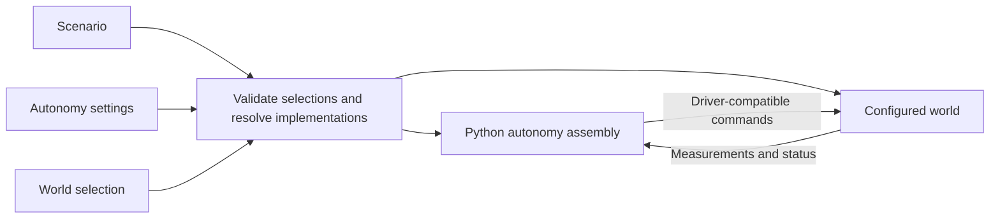

# Architecture

Target design; remaining work is recorded in the [implementation plan](implementation_tasks.md), and current support in the [world construction guide](../src/robo_arch/core/worlds/README.md). File placement and build details are in [build_and_layout.md](build_and_layout.md).

## Purpose

Use the same model-based or learned autonomy stack in Drake, on the robot, and in batched Isaac Lab training. Drake is the preferred simulation and evaluation environment; algorithms may use other numerical libraries. Training must not require a separately maintained autonomy stack.

The first application is a UR7e with an actuated gripper placing nuts onto a pin. Prefer the WSG used by the manipulation project if its assets meet the required physics and licensing checks; Robotiq is an alternative, not a gate requirement. Arm tracking establishes an initial reuse baseline; it does not establish the required manipulation or deployment architecture. Mounted actuated tools, movable objects, shared numerical computation, a realistic hardware boundary without hardware, and clean-machine reproduction are acceptance gates before further backend/demo expansion. Gripper model, sensors, part dimensions and hardware command interface remain open. Placement onto an unthreaded pin is the current assumption. The [implementation plan](implementation_tasks.md#architecture-acceptance-work) owns the assignments and required evidence.

## Scenario, autonomy, world

| Selection | Describes                                                                    |
| --------- | ---------------------------------------------------------------------------- |
| Scenario  | Selected robot system, object instances, task and layout; references models and calibration |
| Autonomy  | Python assembly functions and configured parameters                      |
| World     | Real installation or supported simulator setup; resolves compatible autonomy execution adapters and owns native runtime/viewing settings |

The runnable `scenarios/arm_tracking/scenario.yaml` and its iiwa/bimanual/contact variants contain world/timing settings, a robot-system selection with its autonomy settings, object models and poses, and task parameters. The reusable physical assembly remains in `robot_system/ur7e_d435/system.yaml`. Selecting the system and autonomy together makes their compatibility visible without fixing an autonomy stack inside the assembly definition.

The scenario selects a **robot system**: a composition of robots, actuated tools and sensors, or other robot systems. The loaded configuration preserves this hierarchy, local names and relative placements; shared world assembly resolves namespaced devices and robot pose chains. Disabling sensor observations preserves their physical bodies, masses and collision geometry. For example, a bimanual system can instantiate the same arm-with-wrist-camera definition twice with distinct names and runtime state. Hardware bindings and calibration must also identify the individual instance when introduced. Internal mounts belong to the system; the scenario layout places whole systems and external objects. Simulation uses those placements as initial/setup conditions; hardware uses calibrated relationships or nominal conditions to verify, not commands to reposition reality.

Robot/tool composition must support attachment to a named parent frame, including a moving arm flange, while preserving each device's joint and command identity. The current loaders fix every robot base to world and cannot mount an actuated tool this way. A mounted, actuated gripper working with the UR7e in both simulators is a mandatory gate before further expansion; a neutral test fixture can exercise the loader but cannot close that gate. The gripper model and hardware interface remain open. Detailed acceptance belongs in the [implementation plan](implementation_tasks.md).

Swapping robot systems, or selecting another device within a system definition, can retain the same scenario objects and task. It may require different calibration, layout or configured autonomy. Robot-system composition and autonomy composition remain separate: physical assembly does not force a particular control stack.

Robot and sensor packages own their assets, device-specific controllers/IK/drivers, calibration profiles and tests. Actuated tools belong under `robots/`. System packages own assembly-specific logic and relationships; scenario packages own task descriptions/evaluation and task-specific autonomy. Reusable numerical algorithms, configuration loading and world assembly live under `core/`. A UR7e inverse-dynamics controller should configure or specialize shared code rather than duplicate it.

Measured calibration lives with the relationship it describes: within a robot/sensor, between members of a robot system, or between that system and scenario fixtures. Record the relevant instance identities, units, mounting arrangement and revision, and select the effective profile explicitly. Nominal assets/layout and measured corrections remain distinct. Nested instances must not silently share incompatible calibration or conflicting definitions of the same transform. Calibration selection and hardware bindings are target requirements; the current loader supports nominal placements only.



Robot and sensor descriptions establish available observations; the robot and selected world jointly establish accepted commands. The stack may also need a robot dynamics model, calibration, object geometry and task goals. A compatible interface is necessary, but does not establish that a controller is suitably tuned for that robot.

Keep reusable algorithms separate from configured instances. Inverse dynamics can serve many manipulators; its model, joint selection and gains belong to the selected setup. Gains can depend on tool, payload, command interface and control rate. Keep them with the robot, system or scenario whose assumptions they encode; each device owns its intrinsic asset defaults.

The task specifies the outcome and evidence for success, referring only to participating object instances: a nut and pin can be task participants while the table and background objects remain part of the scene. A task description is not an autonomy component or a mandatory planning strategy. Object geometry and nominal placement do not provide its measured current pose: that needs a measurement, estimator or explicit known-pose assumption. Simulation ground truth remains distinct from deployable observations. Preserve the nut's hole in collision geometry.

Movable objects require explicit free-body physics, initial pose and velocity, runtime state and reset support in both simulators. Object instances must distinguish these bodies from fixed fixtures. Dropping, pushing, grasping, lifting and releasing objects through physical contact are required manipulation gates; changing a declared pose or attaching an object by script does not establish them. Current object loading creates fixed fixtures only.

## Composing autonomy

Compose autonomy in Python using the selected runtime's native facilities. In Drake, ordinary construction functions add Systems to a DiagramBuilder, connect native ports and return Systems or Diagrams. Reuse those functions across scenarios. There is no project-wide component object, graph schema, port-type system or universal factory context. A policy can remain one System; a model-based stack can be a Diagram.

Keep scene/device assembly reusable under `core/worlds/`; put task-specific connections in the scenario and reusable stacks with their robot, system or shared algorithm owner. Controller `connect` functions wire robot observations and commands, then return native task-reference ports. The scenario supplies desired-state wiring; the world constructs and initializes the native simulator. Drake exposes its `Simulator` and scene directly, without another simulation wrapper. Construction code checks robot identity, joint order, units, command mode and frames where they matter; equal vector lengths alone do not establish compatibility.

The scenario selects algorithms, composition and parameters. The selected world
resolves compatible execution adapters centrally, preserving those algorithm
semantics. Scenarios must not contain world/backend compatibility ladders or
substitute a different control law or nominal model to obtain a supported
runtime. Keep this selection ordinary construction code; it requires no universal
graph, component registry or factory framework.

Concretely, world construction calls the selected algorithm owner's construction
function with the resolved mechanism, device command/observation capabilities
and execution settings. That owner selects its native port or array adapter;
the scenario supplies references and connects the returned native interfaces.
Resolve nominal control and filters together, including solver precision and
acceptance tolerances. A scalar implementation on CUDA physics must be reported
as scalar with transfers; a requested tensor implementation must fail if absent.
An effort controller cannot become a position-trajectory controller through an
adapter. The initial UR deployment boundary may therefore reject existing effort
stacks while supporting explicitly selected trajectory autonomy.

The [camera-protection scenario](../src/robo_arch/scenarios/camera_protection/README.md)
composes a nominal effort controller with a reusable
[sphere CBF filter](../src/robo_arch/core/controllers/cbf/README.md).
Model-owned sphere profiles describe conservative geometry; scenario autonomy
selects protected instances, pairs, margins and explicit mounting exclusions.
The Drake filter uses an independent dynamics model and bounded torque QPs.
The current Torch/Moreau path shares barrier equations but maintains a separate
handwritten Torch dynamics tree and scenario-specific backend restrictions.
These are transitional implementations that do not meet the shared numerical
implementation and world-owned selection requirements. Its current Isaac
execution requires PhysX/PGS; Newton camera protection remains unsupported.
Its discrete simulation evidence does not establish hardware safety.

YAML selects physical assets, instances, layout, task, autonomy settings and world. It does not describe executable autonomy graphs, child-port exports or scheduling. Loaded records and device metadata live in `core/config/declarations.py`; `loading.py` owns the YAML document schemas, parses YAML and resolves referenced systems. `schema.py` defines the common strict validation policy used by document, world and parameter schemas. Use safe loading and typed validation with PyYAML and Pydantic. Resolve YAML references through `package://robo_arch/...` resources in the installed application package, independently of the declaring file or working directory; reject duplicate keys, unknown fields and recursive physical-system inclusion. Keep defaults in parameter schemas and avoid generic deep-merge inheritance. Training sweep tools can sit outside this loader.

## World implementations

Use explicit world adapters around one authoritative numerical implementation
of each algorithm, including nominal dynamics. A world switch reuses algorithm
code and parameters; it need not reuse a parsed execution graph. A separately
maintained CPU/GPU dynamics tree is not an acceptable reuse boundary, even with
parity tests. The numerical library and batched execution mechanism remain open.
Existing Drake computation provides a shared scalar baseline, with explicit transfer and
throughput costs in batched worlds; it does not demonstrate GPU control execution.
Drake owns its Systems, Diagrams, scheduling and state. Batched execution uses
appropriate native operations without requiring a Diagram per environment.

Evaluate a maintained computation dependency before extending project-owned
dynamics. These candidates remain proposals, not selected dependencies:

| Candidate | Relevant evidence and unresolved fit |
|---|---|
| [PyRoki](https://github.com/chungmin99/pyroki) | JAX URDF kinematics and optimization; these capabilities alone do not replace mass, bias-force and acceleration calculations. |
| [JaxSim](https://github.com/gbionics/jaxsim) | Standalone mass, bias-force and Jacobian queries with CPU/GPU execution; experimental API and URDF conversion through sdformat require compatibility/build evaluation. Its contact engine is not proposed as another world. |
| [frax](https://github.com/StanfordASL/frax) | JAX kinematics and dynamics; beta API, excluded closed chains and guidance to fix gripper joints outside the controlled tree require scrutiny against the complete moving assembly. |

Any candidate must preserve the compound arm/gripper model, joint/actuator maps,
frames, gravity, damping and rotor-inertia assumptions. Verify the same numerical
source at batch size one on deployment CPU and batched on CUDA, including command
conversion and solver tolerances. Include startup/compilation, array exchange and
steady-state costs; library throughput claims are not repository measurements.
Generated execution is acceptable only from that authoritative computation and
model, without hand-edited numerical outputs. [JAX AOT compilation](https://docs.jax.dev/en/latest/aot.html)
specializes shapes/dtypes; its process-local compiled objects do not establish
portable deployment artifacts. Preserve existing supported behavior while
replacement selection and validation remain open.

If a shared dynamics implementation cannot cover a required mode, document the
specific limitation before accepting a narrow native query. For the current
effort controllers it must evaluate caller-supplied mechanism state and identify
the terms in `M(q) vdot + h(q,v) = B(q) u`; CBF control also needs point positions,
velocity Jacobians and their bias accelerations. Specify joint/frame order,
actuation mapping, units, model/calibration identity, batch/device ownership and
which gravity, passive, contact or external forces are included. Deployment needs
a nominal-model provider for the same contract; reading simulator buffers is
privileged input, not a substitute. A simulator-specific provider preserves only
the documented controller/query contract, not a claim of shared dynamics code.

Robot descriptions are data: `robots/<model>/robot.yaml` references physical assets through `package://robo_arch/...` and records joint/frame conventions and nominal defaults. Shared world loaders parse those assets by supported format; adding an ordinary robot requires no Python factory, forwarding wrapper or per-world robot directory. Simulation and independent controller models consume the same declared asset. Specialized controllers, IK, hardware drivers and genuinely device-specific simulation behavior remain beside their robot when needed.

Read declarations without importing simulator SDKs or robot code. Sensor and object lookup currently calls their typed `describe()` functions; sensor observation implementations remain explicit native adapters. Sensor and object metadata declares supported worlds; sensor physical support remains separate from observation support. Check the world's implemented asset/behavior support, not the existence of a robot adapter module. The current robot import paths support fixed-base effort URDFs in Drake and Isaac; an asset does not supply a hardware driver. YAML model identifiers cannot supply import paths. World-owned controller selection must check observations, commands, joint/frame conventions and execution requirements before startup. Missing support is an error. When a batched world supports scalar or CPU execution, warn about that cost and known transfers. Never silently substitute a different controller or change its feedforward source. Name intentional approximations, including privileged ground truth, and record the actual implementation selected.

`core/worlds/<world>/scene.py` consumes `SceneConfiguration` and native settings to construct physics. `scenario.py` consumes `RunConfiguration` and a scenario-supplied Python `configure` function to wire autonomy and launch execution; it returns data for scenario evaluation. Drake advances its native `Simulator` once to the run boundary, with native diagram events handling visualization and signal logging; no shared simulation recorder or Python sampling loop is required. Each world also owns `config.py` and `visualization.py`. Real construction/execution currently fails explicitly because hardware adapters are absent. Implementations own timing, initialization and reset behavior. World integration coordinates physical reset; each controller or policy resets its own state. Resetting a real controller does not reposition the robot. Add timing, reset and execution metadata only when an implemented consumer needs it; no universal scheduler or performance framework is required.

For Isaac, the selected native Lab environment must own context/scene lifecycle,
observation collection, control decimation, terminal observations and selective
reset. The pinned Lab `DirectRLEnv` source creates its own context and
`InteractiveScene`, rejecting an existing context; reusable scene population
must therefore populate those owned objects. Its explicit physics-step loop is
legitimate native execution. Exact environment choice remains provisional;
scenarios supply task, reference and evaluation behavior through native hooks
instead of maintaining independent rollout lifecycle code.

Preserve the pinned lifecycle semantics during migration: action preprocessing
runs once per environment step, while action application runs at physics
substeps unless the backend handles decimation. Specify where feedback is
recomputed versus held. `DirectRLEnv` normally returns observations after
automatic reset; its optional `compute_final_obs` captures terminal observations
first. Episode evaluation must retain those terminal samples and termination
versus timeout status. Reset the selected mechanism, free objects, controller
memory and task state together, preserving other environments and global time.
Do not trade away terminal observations or sensor freshness for mask-only reset
performance. Validate exact-duration behavior, failure cleanup and viewing with
the pinned source before replacing the current runners.

The [world construction guide](../src/robo_arch/core/worlds/README.md) maps the current configuration-to-physics paths, records asset translation limits and explains how to add a world. All objects remain fixed fixtures. Isaac supports a validated single-box SDF subset and rejects unsupported content before launch; it does not provide general SDF physics import.

The `isaac` world uses Isaac Lab 3.0 Early Access with selectable PhysX or Newton/MuJoCo Warp physics. SDK-independent settings select the backend and solver; PhysX remains the default. Lab owns scene buffers and physics stepping; project adapters assemble declared assets and invoke shared autonomy. `num_envs` defaults to one; `env_spacing` sets separation in metres and `env_layout` selects a line or grid. PhysX uses USD cloning/full parsing with collision groups; Newton uses native model replication and isolated worlds.

### World configuration and visualization

Each world owns its validated, SDK-independent schemas in `core/worlds/<world>/config.py`. `core/config/worlds.py` selects among these types for run composition and parsing; shared validation and resource-reference rules stay in `core/config/`. The scenario's `world` is an inline mapping or a `package://robo_arch/...` reference to one complete profile. Unknown and foreign settings are rejected; profiles have no inheritance or deep merging. Scenario duration and evaluation stay outside the world. Simulation time steps belong to physics; real-world settings contain transport instead.

Native resource limits belong in world configuration, but workload-specific
tuning belongs in the selected profile rather than global defaults justified by
a particular device. The current Mini45-driven PhysX capacity default and
camera-protection-specific log sampling in `IsaacWorld` need that ownership
correction. Scenario sampling belongs with its evaluation/reporting owner.
Keep necessary SDK compatibility workarounds isolated to the affected version,
with a documented reason, removal condition and lifecycle validation; private SDK
state manipulation must not become a normal construction contract.

```yaml
world:
  type: drake
  target_realtime_rate: 1.0          # wall-clock pacing; zero means unpaced
  physics:
    time_step: 0.001                # seconds, independent of display cadence
    contact_model: hydroelastic_with_fallback
    discrete_contact_approximation: sap
    sap_near_rigid_threshold: 1.0
  visualization:
    type: meshcat
    mode: live_and_record
    publish_period: 0.015625
    publish_illustration: true
    publish_proximity: true
    publish_contacts: true
    publish_inertia: true
```

| World | Implemented runtime configuration | Viewer and limits |
|---|---|---|
| Drake | Discrete plant step; point, hydroelastic or fallback contact model; SAP, similar or lagged approximation; SAP near-rigid threshold; independent wall-clock pacing | `DrakeVisualization` mirrors `VisualizationConfig` display fields/defaults; `ApplyVisualizationConfig` wires illustration, proximity, contacts and inertia together. Colors use SDK-independent RGBA tuples. Additional controls select browser opening and modes: `off`, `live`, `record`, `live_and_record`. |
| Isaac | PhysX step, TGS/PGS solver, `cpu`/`cuda:0` device | Headless (`off`) or native Kit Storm viewing (`live`). Collision overlays and RTX rendering remain unsupported. Mixed-arm tracking was exercised with CPU/PGS and GPU/TGS; Mini45 sensing and deliberate contact run with GPU/TGS. |
| Real | ROS 2 namespace and `system`/`ros` clock declarations; no simulated physics | Independent RViz 2 launcher with `off`/`live`, fixed frame and optional package-referenced display configuration. Command/lifecycle tests use a fake process; RViz rendering and hardware execution are unvalidated. |

For example, an Isaac profile contains `type: isaac`, `physics: {time_step: 0.001, solver: tgs, device: 'cuda:0'}` and `visualization: {type: isaac, mode: "off"}`. A real profile contains `type: real`, `transport: {type: ros2, namespace: /cell, clock: system}` and `visualization: {type: rviz2, mode: live, fixed_frame: world}`. These are separate native concepts, not equivalent physics or a universal viewer API. Production solver tuning remains a deployment decision.

The CLI's `--world` replaces the complete configuration with native defaults; `--world-config` loads a complete profile. Explicit viewer overrides are validated again. Effective settings are retained with run metadata. Schema defaults leave viewers off; the packaged arm-tracking scenario explicitly selects Drake recording.

The [world-settings API reference](api/worlds.rst) owns field descriptions,
defaults and validation constraints for the SDK-independent schemas. Meshcat
creation and transport belong to the world implementation; mouse-applied forces
remain disabled. Lower-level visualizer parameters are added only for a concrete
inspection need.

Collision geometry, friction, hydroelastic classification and mesh resolution belong to the asset or its explicit world-specific profile. Per-articulation tuning belongs to its device/system. World configuration must not silently overwrite these assumptions. Enabling a layer does not change an asset’s contact model. UR7e and iiwa 7 now have upstream-derived visual and collision meshes. Both engines use per-link convex hulls; Mini45 convex sectors preserve the bore. Sensor bodies are assembled before plant finalization or PhysX initialization. Device READMEs identify geometry and inertia approximations. Drake contact diagnostics are checked with a separate fixture that explicitly supplies hydroelastic properties.

### Viewer lifecycle and inspection

World-specific construction and launch functions own native settings and viewer lifecycle; there is no shared visualizer base class or scheduler. Apply startup settings before opening a runtime, physics settings before finalizing its scene, and viewer wiring once scene/state sources exist. Unsupported modes and missing required displays fail explicitly. Native Isaac live viewing uses Storm, serializes rendering with explicit physics steps, and publishes USD transforms at display cadence. It saves a final viewport PNG; video recording is unsupported. The runner never substitutes Drake playback.

Viewer selection is separate from sensor observations. `--headless` changes viewing intent and preserves configured sensors. Isaac requires the separate `--no-sensors` selection only for camera-equipped examples because image generation is unavailable. Mini45 wrench sensing is supported in both worlds; disabled observations retain the sensor bodies. Mouse-applied forces are disabled for observational inspection. Drake live inspection holds the final scene until **Close inspection** or Ctrl-C; recordings remain usable after exit. RViz owns only its viewer process and subscribes to existing observations/TF without starting drivers or hardware command connections.

The runner writes all resolved inputs, configuration hashes, package versions, results/errors and a copyable `--inspect` command. Inspection restores those inputs and overrides only viewing intent; Isaac reruns in its native viewport. Source/assets are identified by hashes and versions, not snapshotted. Headless tests and visual inspection use the same physics, initial state and sensor selections. Retain partial recordings or measured traces on runtime failures where available, and attach an actual run visualization when requesting human review. Seeds and calibration versions must be included when those features are introduced.

Drake HTML retains geometry transforms and force arrows, but changing hydroelastic contact surfaces and pressure fields need live inspection; a saved surface can be a static final mesh. The explicit `replay_positions` helper remains secondary geometry inspection: a position trace cannot reconstruct source-world contacts, pressure, velocities or sensor images. Real-world replay requires recorded observations and TF; no hardware runner exists.

Validation covers schema rejection without SDK imports, native Drake settings/standard visualization, a hydroelastic contact fixture, and numerical consistency with the viewer disabled. Isaac RTX/collision rendering and actual RViz frames/topics remain acceptance work. The iiwa contact example exercises sensor-face collision and wrench measurement in both engines. This does not establish matching contact transients or hardware behavior.

## Constructing and running

Before construction, the world resolves the selected autonomy's compatible
implementation and checks required measurements, accepted commands and
timing/reset requirements. Record effective parameters, model/calibration
versions, the actual numerical implementation and execution adapter. The
mixed-arm example names every robot's target and controller parameters
explicitly. A world switch preserves the stack only when these checks succeed;
simulated torque access does not establish torque access on hardware.

Use ROS 2 at hardware/process boundaries. Keep it outside ordinary component connections and batched rollout data. World integration owns scene/device access; wrappers own algorithm-specific adaptation. Controller models remain separate from simulation state; scenarios must explicitly select and name any privileged simulator-model inputs.

Before physical hardware validation, exercise the intended ROS deployment
adapter for the UR arm against a realistic mock or vendor simulation with its
actual command capabilities. Keep this initial hardware seam limited to the arm. Do not give the mock convenient torque access that the
deployment interface lacks. Validate observation identity and freshness,
disconnection handling, command lifecycle and controller reset through that
same adapter. Fake RViz process tests do not establish this boundary; passing
mock tests still does not establish measured hardware behavior.

Current scalar arm tracking reuses the Drake inverse-dynamics controller or the
C++ PD-plus-feedforward controller in both simulators, including the mixed
bimanual system. Its native PD boundary carries CPU float64 arrays; Python
adapters supply independent-model gravity feedforward. Current batched reaching
uses a separate Torch PD equation and explicitly selected simulator-gravity
feedforward, with GPU task state and masked resets on PhysX or Newton/MuJoCo
Warp. This establishes batched execution, not completion of the authoritative
numerical implementation requirement. Match controller outputs for matching
inputs/state and preserve reset semantics; do not require identical physics
trajectories. Retain supported CPU execution with a cost warning, and measure
GPU behavior without treating residency as evidence of efficiency. The
[implementation plan](implementation_tasks.md) records remaining acceptance gates.

Share physical assembly and control construction functions across simulation and deployment, following the separation illustrated by HardwareStation. Runtime-specific application wiring stays ordinary code; reuse does not require reimplementing Drake's Diagram architecture in a parser.
